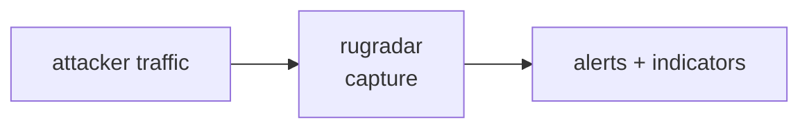

<a name="top"></a>
<div align="center">


# RUGRADAR

### Token contract risk scanner detecting honeypots, hidden mint/blacklist functions, owner backdoors, and unlocked liquidity before you ape.


[](https://pypi.org/project/cognis-rugradar/) [](https://github.com/cognis-digital/rugradar/actions) [](LICENSE) [](https://github.com/cognis-digital)

*Web3 & Smart-Contract Security — on-chain safety and analytics.*

</div>

```bash
pip install cognis-rugradar
rugradar scan .            # → prioritized findings in seconds
```

## Contents

- [Why rugradar?](#why) · [Features](#features) · [Quick start](#quick-start) · [Example](#example) · [Architecture](#architecture) · [AI stack](#ai-stack) · [How it compares](#how-it-compares) · [Integrations](#integrations) · [Install anywhere](#install-anywhere) · [Related](#related) · [Contributing](#contributing)

<a name="why"></a>
## Why rugradar?

Self-hostable, no-API-key rug detector with a transparent open ruleset — trustless alternative to closed scoring services is the adoption hook.

`rugradar` is single-purpose, scriptable, and self-hostable: point it at a target, get prioritized results in the format your workflow already speaks (table · JSON · SARIF), gate CI on it, and let agents drive it over MCP.

<div align="right"><a href="#top">↑ back to top</a></div>

<a name="features"></a>
## Features

- ✅ Scan Source
- ✅ Scan Abi
- ✅ Scan Text
- ✅ Summarize
- ✅ Runs on Linux/macOS/Windows · Docker · devcontainer
- ✅ Ports in Python, JavaScript, Go, and Rust (`ports/`)

<div align="right"><a href="#top">↑ back to top</a></div>

<a name="quick-start"></a>
## Quick start

```bash
pip install cognis-rugradar
rugradar --version
rugradar scan .                       # scan current project
rugradar scan . --format json         # machine-readable
rugradar scan . --fail-on high        # CI gate (non-zero exit)
```

<div align="right"><a href="#top">↑ back to top</a></div>

<a name="example"></a>
## Example

```text
$ rugradar scan .
  [HIGH    ] RUG-001  example finding             (./src/app.py)
  [MEDIUM  ] RUG-002  another signal              (./config.yaml)

  2 findings · risk score 5 · 38ms
```

<div align="right"><a href="#top">↑ back to top</a></div>

<a name="architecture"></a>
## Architecture



<div align="right"><a href="#top">↑ back to top</a></div>

<a name="ai-stack"></a>
## Use it from any AI stack

`rugradar` is interoperable with every popular way of using AI:

- **MCP server** — `rugradar mcp` (Claude Desktop, Cursor, Cognis.Studio, [uncensored-fleet](https://github.com/cognis-digital/uncensored-fleet))
- **OpenAI-compatible / JSON** — pipe `rugradar scan . --format json` into any agent or LLM
- **LangChain · CrewAI · AutoGen · LlamaIndex** — wrap the CLI/JSON as a tool in one line
- **CI / scripts** — exit codes + SARIF for non-AI pipelines

<div align="right"><a href="#top">↑ back to top</a></div>

<a name="how-it-compares"></a>
## How it compares

| | **Cognis rugradar** | Token Sniffer |
|---|:---:|:---:|
| Self-hostable, no account | ✅ | varies |
| Single command, zero config | ✅ | ⚠️ |
| JSON + SARIF for CI | ✅ | varies |
| MCP-native (AI agents) | ✅ | ❌ |
| Polyglot ports (JS/Go/Rust) | ✅ | ❌ |
| Open license | ✅ COCL | varies |

*Built in the spirit of **Token Sniffer / GoPlus Security API**, re-framed the Cognis way. Missing a credit? Open a PR.*

<div align="right"><a href="#top">↑ back to top</a></div>

<a name="integrations"></a>
## Integrations

Pipes into your stack: **SARIF** for code-scanning, **JSON** for anything, an **MCP server** (`rugradar mcp`) for AI agents, and a webhook forwarder for SIEM/Slack/Jira. See [`docs/INTEGRATIONS.md`](docs/INTEGRATIONS.md).

<div align="right"><a href="#top">↑ back to top</a></div>

<a name="install-anywhere"></a>
## Install — every way, every platform

```bash
pip install "git+https://github.com/cognis-digital/rugradar.git"    # pip (works today)
pipx install "git+https://github.com/cognis-digital/rugradar.git"   # isolated CLI
uv tool install "git+https://github.com/cognis-digital/rugradar.git" # uv
pip install cognis-rugradar                                          # PyPI (when published)
docker run --rm ghcr.io/cognis-digital/rugradar:latest --help        # Docker
brew install cognis-digital/tap/rugradar                             # Homebrew tap
curl -fsSL https://raw.githubusercontent.com/cognis-digital/rugradar/main/install.sh | sh
```

| Linux | macOS | Windows | Docker | Cloud |
|---|---|---|---|---|
| `scripts/setup-linux.sh` | `scripts/setup-macos.sh` | `scripts/setup-windows.ps1` | `docker run ghcr.io/cognis-digital/rugradar` | [DEPLOY.md](docs/DEPLOY.md) (AWS/Azure/GCP/k8s) |

<div align="right"><a href="#top">↑ back to top</a></div>

<a name="related"></a>
## Related Cognis tools

- [`reentryx`](https://github.com/cognis-digital/reentryx) — Static + symbolic detector that flags reentrancy, cross-function, and read-only reentrancy paths in Solidity/Vyper with CI-gating SARIF output.
- [`forkfuzz`](https://github.com/cognis-digital/forkfuzz) — Mainnet-fork invariant fuzzer that replays your contract against live state and stateful sequences to break protocol invariants before deploy.
- [`approvewarden`](https://github.com/cognis-digital/approvewarden) — Scans any wallet for dangerous ERC-20/721/1155 token approvals and infinite allowances, scoring drainer exposure and emitting revoke transactions.
- [`mevscope`](https://github.com/cognis-digital/mevscope) — Replays a tx or address history to attribute sandwich, frontrun, and backrun MEV extraction with per-trade loss accounting.
- [`storagelens`](https://github.com/cognis-digital/storagelens) — Diffs and decodes contract storage layouts across proxy upgrades to catch storage-collision and uninitialized-slot bugs.
- [`sigsleuth`](https://github.com/cognis-digital/sigsleuth) — Decodes raw calldata and EIP-712 typed-data into human-readable intent, flagging blind-signing and malicious permit/Permit2 payloads.

**Explore the suite →** [🗂️ all 170+ tools](https://github.com/cognis-digital/cognis-neural-suite) · [⭐ awesome-cognis](https://github.com/cognis-digital/awesome-cognis) · [🔗 cognis-sources](https://github.com/cognis-digital/cognis-sources) · [🤖 uncensored-fleet](https://github.com/cognis-digital/uncensored-fleet) · [🧠 engram](https://github.com/cognis-digital/engram)

<div align="right"><a href="#top">↑ back to top</a></div>

<a name="contributing"></a>
## Contributing

PRs, new rules, and demo scenarios are welcome under the collaboration-pull model — see [CONTRIBUTING.md](CONTRIBUTING.md) and [SECURITY.md](SECURITY.md).

> ### ⭐ If `rugradar` saved you time, **star it** — it genuinely helps others find it.

## License

Source-available under the **Cognis Open Collaboration License (COCL) v1.0** — free for personal, internal-evaluation, research, and educational use; **commercial / production use requires a license** (licensing@cognis.digital). See [LICENSE](LICENSE).

---

<div align="center"><sub><b><a href="https://cognis.digital">Cognis Digital</a></b> · one of 170+ tools in the <a href="https://github.com/cognis-digital/cognis-neural-suite">Cognis Neural Suite</a> · <i>Making Tomorrow Better Today</i></sub></div>
